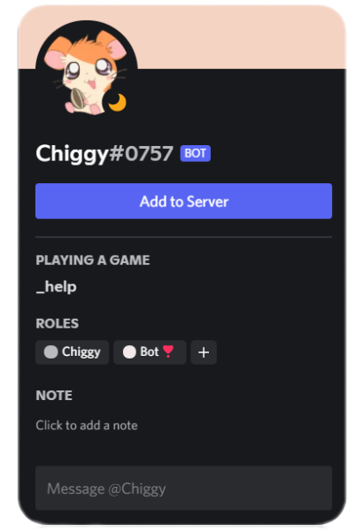
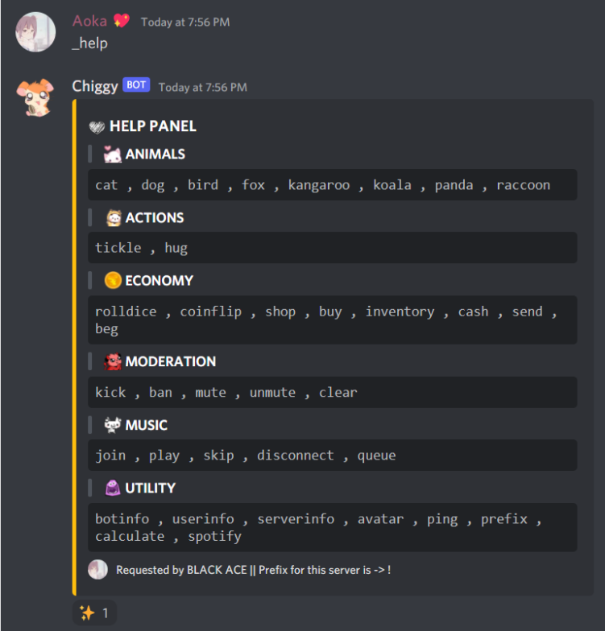

# ✨ Chiggy's Documentation

## OVERVIEW 💫

Chiggy is a versatile Discord bot designed to enhance your server experience with a wide range of features. From moderation tools to virtual economy systems and entertaining mini-games, Chiggy has something for everyone. With an intuitive command structure and seamless integration, Chiggy is the perfect addition to any Discord community.

## FEATURES 📒

### Moderation Tools
- Keep your server in check with Chiggy's robust moderation tools, including ban, kick, mute, and message clearing functionalities.
- Maintain order and enforce rules effortlessly.

### Virtual Economy System
- Engage your community with a virtual economy system where users can earn and spend virtual currency.
- Enable in-game transactions and foster a thriving economy within your server.

### Mini Games
- Challenge your friends to exciting mini-games right within Discord.
- From trivia quizzes to word games, there's never a dull moment with Chiggy.

## USAGE 😎

- **Prefix**: The universal prefix for Chiggy commands is `_`.
- To view the list of available commands, simply type `_help` or `{changed_prefix} help`.

1. Invite Chiggy to your Discord server using the provided invite link.
2. Set up the necessary permissions for Chiggy to perform moderation actions and interact with users.
3. Customize Chiggy's settings and configure any additional features according to your preferences.

## IMAGES 📸

Here are some screenshots showcasing Chiggy in action:
- 
- 

## ABOUT TEAM 💪🏻

- [Alorika Jain](https://github.com/BLACKACE13) - Developer
- [Ashutosh Das](https://github.com/dashutosh04) - Developer

## LICENSE

Chiggy is distributed under the [MIT License](LICENSE). Feel free to use, modify, and distribute the code as per the terms of the license.

## ACKNOWLEDGEMENTS

We would like to thank the developers of the libraries and APIs used in Chiggy for their invaluable contributions to this project.

---

Thank you for choosing Chiggy as your Discord bot companion. We hope you enjoy using it as much as we enjoyed creating it!
